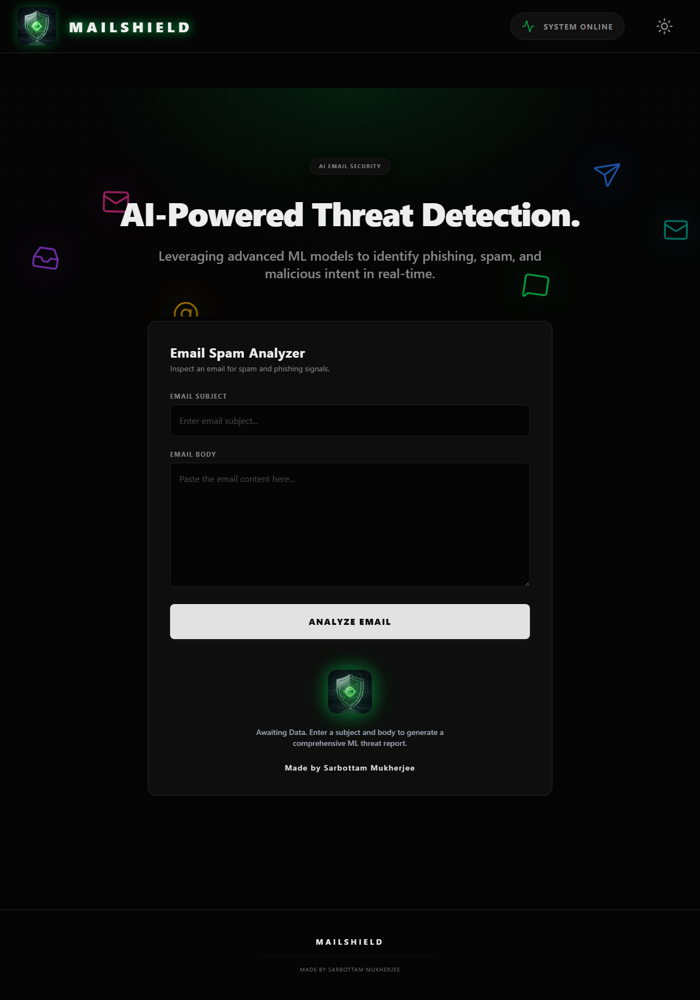
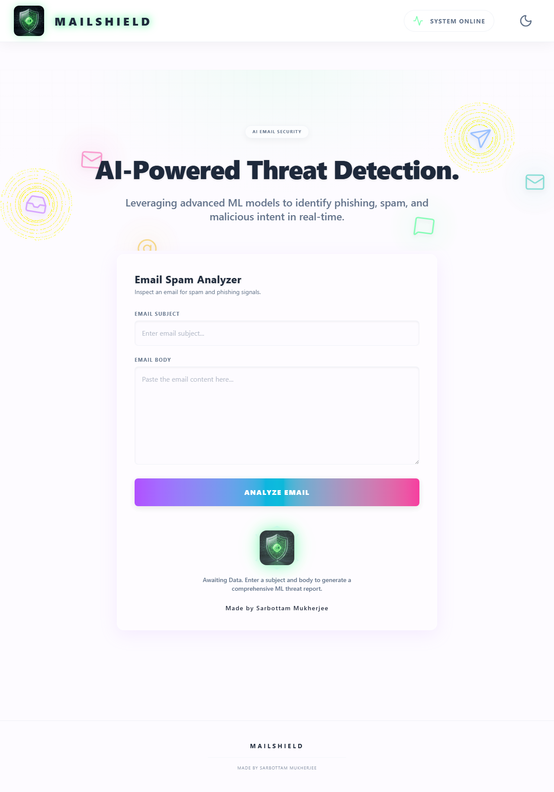
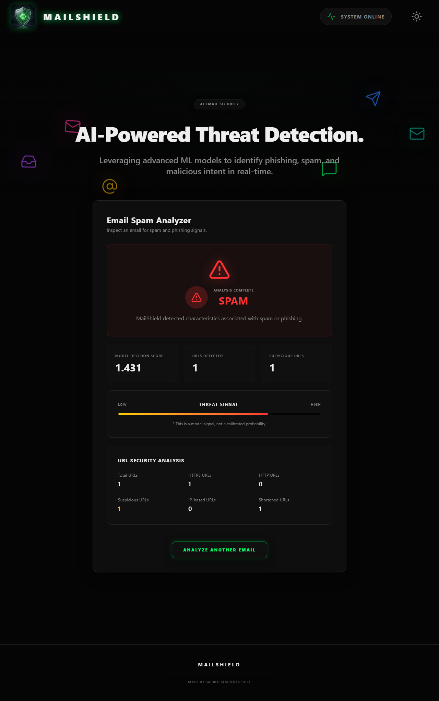
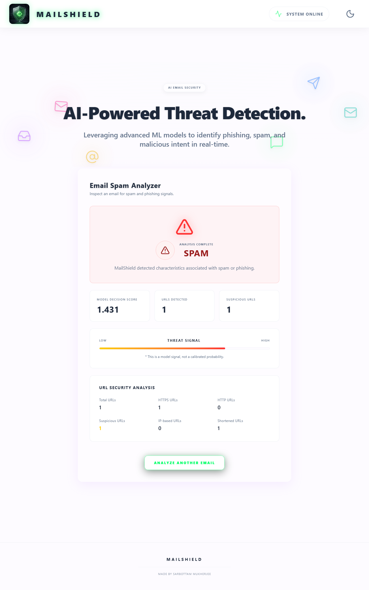
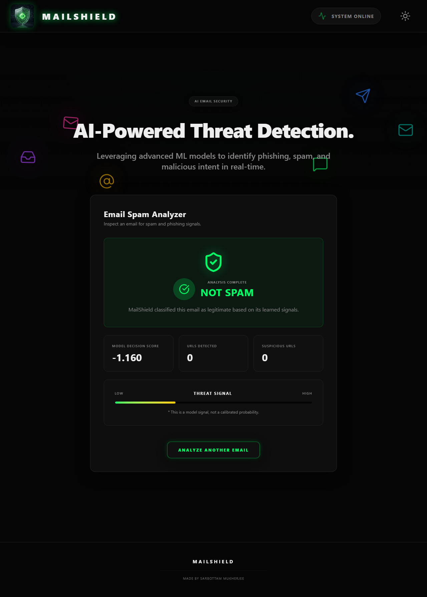
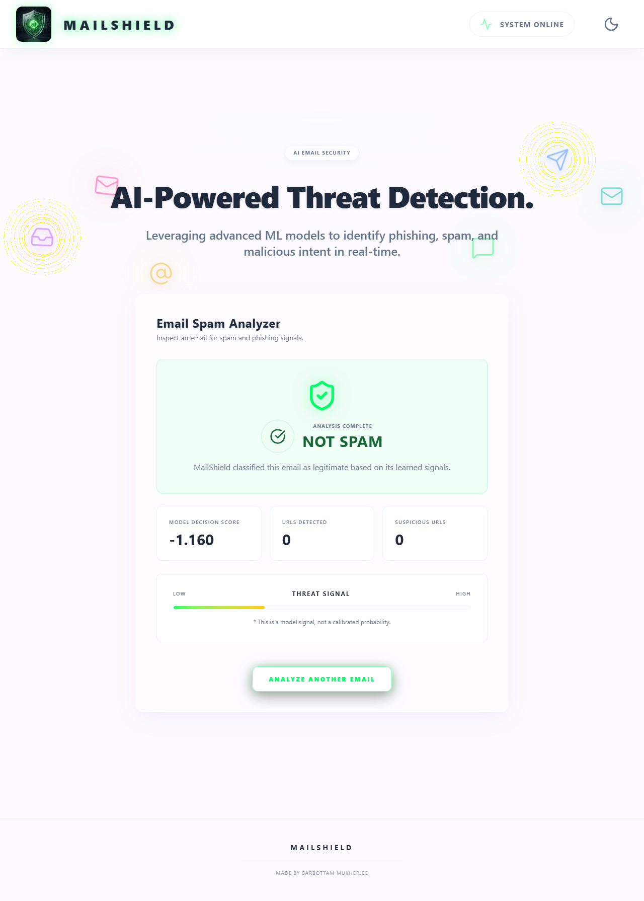
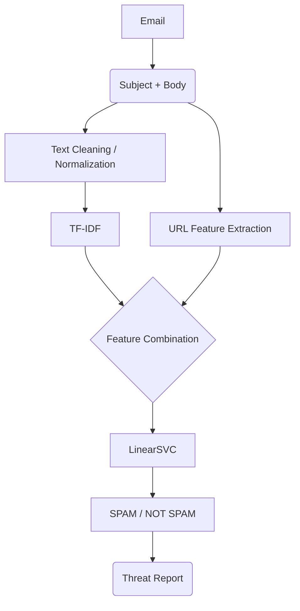
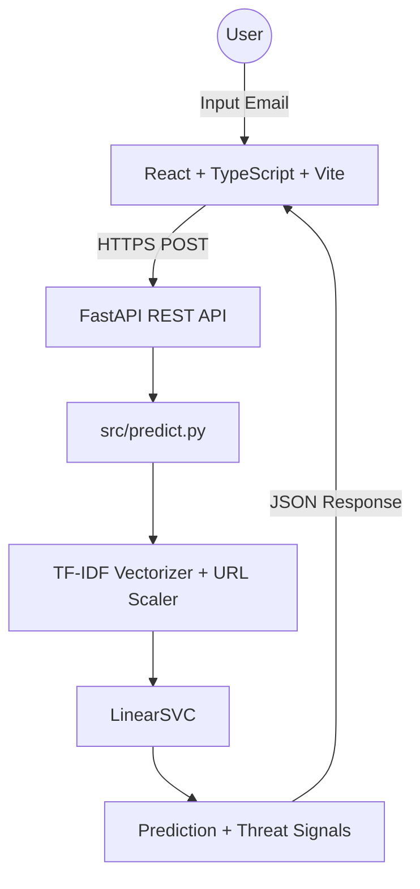

<div align="center">
  
  <h1>MailShield</h1>
  <p><strong>AI-Powered Email Spam & Phishing Detection</strong></p>
  <p>MailShield is a premium, NLP-based cybersecurity application that analyzes email content using TF-IDF feature extraction, machine learning classification, and URL-based threat signals to accurately detect spam and phishing attempts.</p>
  
  <br>

  <a href="https://mailshield-frontend.onrender.com">
    
  </a>

  <br><br>

  
  
  
  
  
  
  
</div>

<br>

---

## 🟢 Live Status

The application is deployed and fully operational:

- **🟢 LIVE APPLICATION:** [https://mailshield-frontend.onrender.com](https://mailshield-frontend.onrender.com)
- **🟢 API ONLINE:** [https://mailshield-heu9.onrender.com/docs](https://mailshield-heu9.onrender.com/docs)

*The React frontend communicates securely with the deployed FastAPI inference service for real-time analysis.*

---

## 📸 Screenshots

| Dark Mode | Light Mode |
| :---: | :---: |
| **Home / Analyzer**<br> | **Home / Analyzer**<br> |
| **SPAM Detection Result**<br> | **SPAM Detection Result**<br> |
| **NOT SPAM Detection Result**<br> | **NOT SPAM Detection Result**<br> |

---

## 🛡️ Project Overview

MailShield is an NLP-powered email security application designed to classify email messages as **SPAM** or **NOT SPAM** with extremely high accuracy. 

It combines:
1. Advanced text preprocessing
2. TF-IDF feature extraction
3. URL threat features
4. LinearSVC classification
5. FastAPI inference API
6. React/TypeScript frontend

The system analyzes multiple threat vectors simultaneously, including the email subject, email body, extracted URLs, URL counts, HTTP/HTTPS usage, IP-based URLs, shortened URLs, suspicious URL keywords, overall URL length, and unique domains. 

*(Note: MailShield utilizes structural URL heuristics and NLP rather than performing external threat-intelligence reputation lookups.)*

---

## ⚙️ ML Pipeline Architecture



---

## 📊 Dataset

MailShield was trained on a robust, consolidated corpus of **82,486 emails** from established cybersecurity datasets:

| Source | Count |
| --- | --- |
| SpamAssassin | 5,809 |
| Nigerian Fraud | 3,332 |
| Enron | 29,767 |
| Ling | 2,859 |
| CEAS_08 | 39,154 |
| Nazario | 1,565 |
| **Total** | **82,486** |

**Class Distribution:**
- **HAM:** 39,595
- **SPAM:** 42,891

**Data Split:**
- Training: 65,988
- Testing: 16,498

*(Note: The consolidated `phishing_email.csv` represents the final dataset and should not be concatenated with the raw source files).*

---

## 🧹 Text Preprocessing

The preprocessing pipeline ensures the ML model receives highly normalized data. The actual TF-IDF input is the `text_normalized` field, processed via:

- MIME subject decoding
- HTML removal
- Control character cleanup
- Whitespace normalization
- Lowercasing
- URL normalization to `URL`
- Email address normalization to `EMAIL`
- Tokenization
- Stopword processing
- Lemmatization

---

## 🧮 TF-IDF Configuration

The model uses a highly optimized TF-IDF vectorization strategy producing sparse CSR matrices.

```python
TfidfVectorizer(
    lowercase=False,
    max_features=100000,
    ngram_range=(1, 2),
    min_df=2,
    sublinear_tf=True
)
```

**Training TF-IDF Shape:** `65,988 × 100,000`

---

## 🔗 URL Features

Because the original dataset's "urls" field contained metadata rather than reliable raw URL text, URLs are extracted directly from the email body content during inference. Nine specific structural features are calculated:

1. `url_count_extracted`
2. `http_count`
3. `https_count`
4. `ip_url_count`
5. `short_url_count`
6. `suspicious_url_count`
7. `avg_url_length`
8. `max_url_length`
9. `unique_domain_count`

---

## 📈 Model Comparison

Extensive evaluation was conducted to select the best performing model.

| Model | Accuracy | Precision | Recall | F1 Score |
| --- | --- | --- | --- | --- |
| MultinomialNB | 97.1754% | 98.9265% | 95.6055% | 97.2377% |
| LogisticRegression | 98.6483% | 98.5475% | 98.8577% | 98.7024% |
| LinearSVC (TF-IDF only) | 99.2302% | 99.2656% | 99.2540% | 99.2598% |
| **LinearSVC + URL Features** | **99.24%** | **99.23%** | **99.30%** | **99.27%** |

**Final Deployed Model:** `LinearSVC + TF-IDF + URL Features`

*(Note: The LinearSVC `decision_score` is a raw margin-based model decision signal and is NOT a calibrated probability).*

### Confusion Matrix

| | Predicted HAM | Predicted SPAM |
| --- | --- | --- |
| **Actual HAM** | 7853 (True HAM) | 66 (False SPAM) |
| **Actual SPAM** | 60 (False HAM) | 8519 (True SPAM) |

---

## 💻 Tech Stack

### Frontend


### Backend


### Machine Learning


---

## 🌐 System Architecture



---

## 🔌 API Documentation

**Endpoint:** `POST /api/analyze`

**Request:**
```json
{
  "subject": "URGENT: Verify Your Account",
  "body": "Please verify your account: https://bit.ly/secure-login"
}
```

**Response:**
```json
{
  "prediction": "SPAM",
  "decision_score": 1.43,
  "url_count": 1,
  "suspicious_url_count": 1,
  "url_stats": {
    "url_count_extracted": 1,
    "http_count": 0,
    "https_count": 1,
    "ip_url_count": 0,
    "short_url_count": 1,
    "suspicious_url_count": 1,
    "avg_url_length": 27.0,
    "max_url_length": 27,
    "unique_domain_count": 1
  }
}
```
*(Decision scores may vary dynamically based on exact input variations).*

**Swagger UI:** [https://mailshield-heu9.onrender.com/docs](https://mailshield-heu9.onrender.com/docs)

---

## 🚀 Run MailShield Locally

I use **TWO** terminals to run MailShield locally. Follow these exact commands:

### TERMINAL 1 — BACKEND:

```powershell
cd C:\Users\SARBOTTAM\Desktop\Project\MailShield

python -m venv .venv
.venv\Scripts\activate

pip install -r requirements.txt

uvicorn backend.main:app --host 127.0.0.1 --port 8001
```

### TERMINAL 2 — FRONTEND:

```powershell
cd C:\Users\SARBOTTAM\Desktop\Project\MailShield\frontend

npm install
npm run dev
```

---

## 👨‍💻 Developer
**Sarbottam Mukherjee**  
[GitHub Repository](https://github.com/mukherjeesarbottam-gif/MailShield)
